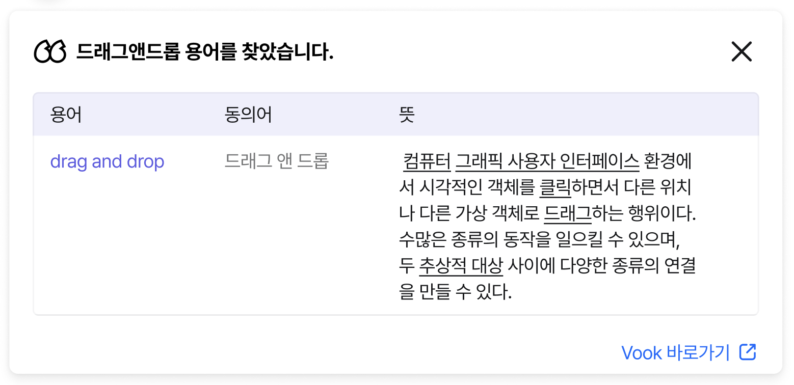
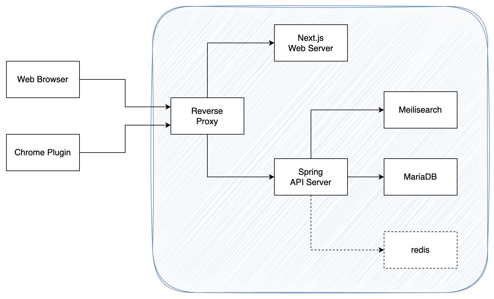
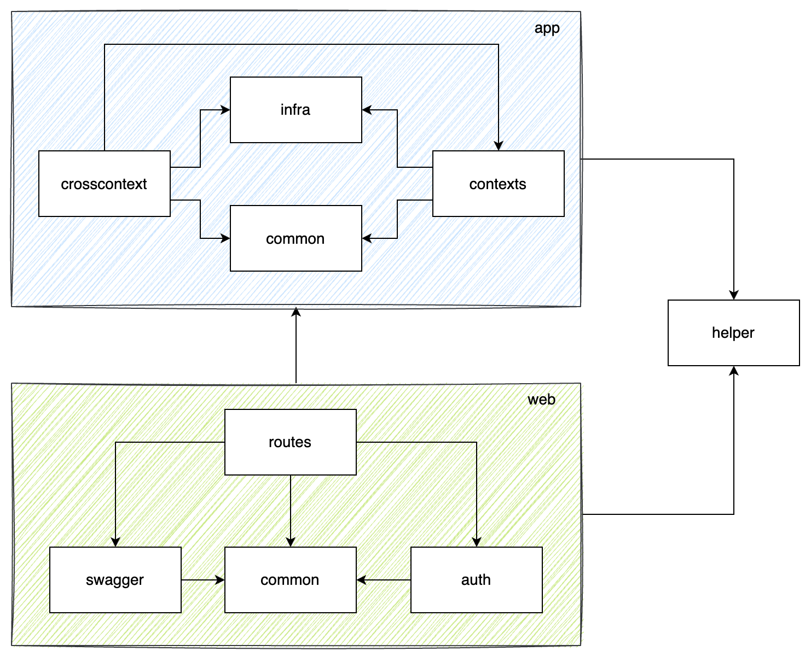
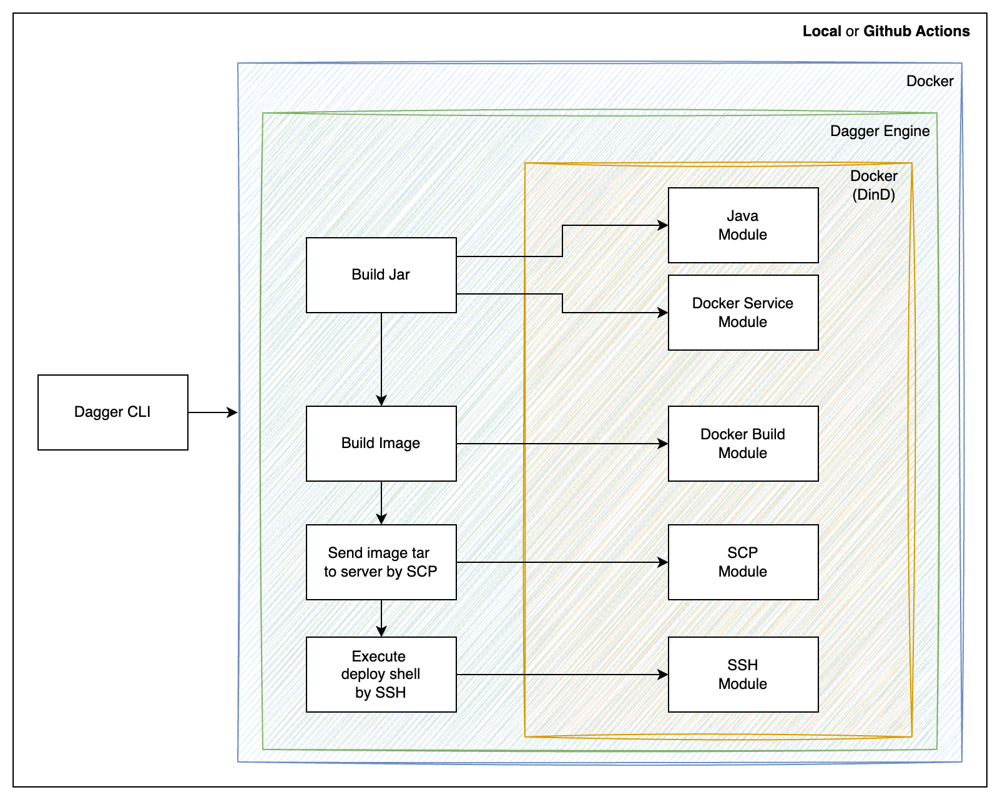

---

# 용어의 의미를 가장 쉽고 빠르게 찾는 방법

---

### Target

용어집을 만들고 사용하길 원하는
개인을 위한 Utility 서비스

### Main Problem

원하는 결과를 찾기 어려움

### How to Solve

**드래그앤드롭**으로 쉽게 찾기



---

# 프로젝트 구조 - 레이아웃



---

# 프로젝트 구조 - root (tree)

```
.
├── api    # Spring API 서버
├── cicd   # dagger 모듈
├── devenv # 개발에 필요한 외부 의존성 (docker)
└── docs   # 관련 문서
```

---

# 프로젝트 구조 - api main package (tree)

```
.
└── vook
    └── server
        └── api
            ├── app              # 앱 파트
            │   ├── common       # 앱 파트 공통
            │   ├── contexts     # 도메인 별 비즈니스 로직
            │   ├── crosscontext # 2개 이상의 도메인이 협력하는 비즈니스 로직
            │   └── infra        # 외부 연동 어뎁터
            ├── config           # 서버 설정 (@Configuration)
            ├── devhelper        # 개발 편의성을 위한 컴포넌트 모음 (운영에서는 미사용 될 로직)
            ├── helper           # 헬퍼 함수
            └── web              # 웹 파트
                ├── auth         # 인증, 인가
                ├── common       # 웹 파트 공통
                ├── routes       # 웹 라우터 (@RestController)
                └── swagger      # Swagger 공통 설정
```

---

# 프로젝트 구조 - api main package (layout)



---

## 도입 기술 - Swagger Schema 재사용

```java
// api/src/main/java/vook/server/api/web/swagger/GlobalOpenApiCustomizerImpl.java
public class GlobalOpenApiCustomizerImpl implements GlobalOpenApiCustomizer {
    @Override
    public void customise(OpenAPI openApi) {
        openApi.getComponents()
                .addSchemas(getKey(ComponentRefConsts.Schema.COMMON_API_RESPONSE), new Schema<Map<String, Object>>()
                        .addProperty("code", new StringSchema().description("결과 코드")).addRequiredItem("code")
                        .addProperty("result", new Schema<>())
                )
                ...
    }
}
```

```java
// api/src/main/java/vook/server/api/web/routes/vocabulary/VocabularyApi.java
public interface VocabularyApi {
    ...
    @ApiResponses(value = {
            @ApiResponse(
                    responseCode = "400",
                    content = @Content(
                            mediaType = "application/json",
                            schema = @Schema(ref = ComponentRefConsts.Schema.COMMON_API_RESPONSE),
                            ...
                    )
            ),
    })
    CommonApiResponse<Void> createVocabulary(VookLoginUser user, VocabularyCreateRequest request);
}
```

---

## 도입 기술 - Swagger Annotation 분리

```java
// api/src/main/java/vook/server/api/web/routes/health/HealthApi.java
@Tag(name = "health")
public interface HealthApi {

    @Operation(
            summary = "서버 상태 확인",
            description = """
                    - 서버의 상태를 체크하는 API입니다.""")
    @ApiResponse(
            responseCode = "200",
            content = @Content(
                    mediaType = "text/plain",
                    examples = @ExampleObject(name = "성공", value = "OK")
            )
    )
    String health();
}
```

```java
// api/src/main/java/vook/server/api/web/routes/health/HealthController.java
@RestController
@RequestMapping("/health")
public class HealthController implements HealthApi {

    @GetMapping
    public String health() {
        return "OK";
    }
}
```

---

## 도입 기술 - Testcontainer

```java
// api/src/test/java/vook/server/api/testhelper/IntegrationTestBase.java
@SpringBootTest(webEnvironment = SpringBootTest.WebEnvironment.RANDOM_PORT)
public abstract class IntegrationTestBase {

    @ServiceConnection
    protected static final MariaDBContainer<?> mariaDBContainer = new MariaDBContainer<>("mariadb:10.11.8")
            .withDatabaseName("example")
            .withUsername("user")
            .withPassword("userPw")
            .withConfigurationOverride("db/conf")
            .withTmpFs(Map.of("/var/lib/mysql", "rw"));

    protected static final MeilisearchContainer meilisearchContainer = new MeilisearchContainer("getmeili/meilisearch:v1.8.3");

    static {
        mariaDBContainer.start();
        meilisearchContainer.start();
    }

    ...

    @Configuration
    public static class TestConfig {

        @Bean
        public MeilisearchProperties meilisearchProperties() {
            MeilisearchProperties meilisearchProperties = new MeilisearchProperties();
            meilisearchProperties.setHost(meilisearchContainer.getHostUrl());
            meilisearchProperties.setApiKey(meilisearchContainer.getMasterKey());
            return meilisearchProperties;
        }
    }
}
```
---

## 도입 기술 - Dagger


