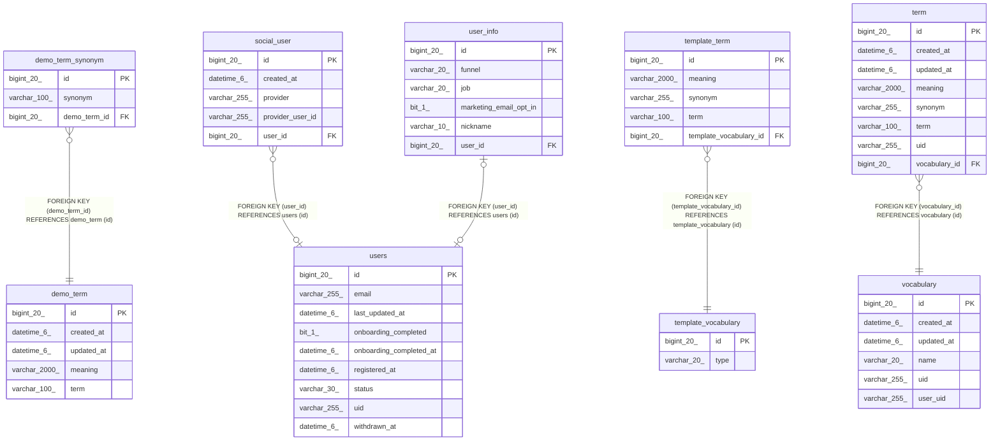

# vook

## Tables

| Name | Columns | Comment | Type |
| ---- | ------- | ------- | ---- |
| [demo_term](demo_term.md) | 5 |  | BASE TABLE |
| [demo_term_synonym](demo_term_synonym.md) | 3 |  | BASE TABLE |
| [social_user](social_user.md) | 5 |  | BASE TABLE |
| [template_term](template_term.md) | 5 |  | BASE TABLE |
| [template_vocabulary](template_vocabulary.md) | 2 |  | BASE TABLE |
| [term](term.md) | 8 |  | BASE TABLE |
| [users](users.md) | 9 |  | BASE TABLE |
| [user_info](user_info.md) | 6 |  | BASE TABLE |
| [vocabulary](vocabulary.md) | 6 |  | BASE TABLE |

## Relations

---

> Generated by [tbls](https://github.com/k1LoW/tbls)
