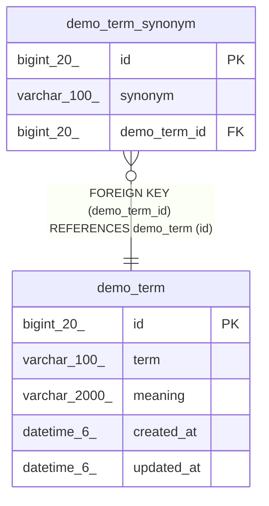

# demo_term_synonym

## Description

데모 용어 동의어

<details>
<summary><strong>Table Definition</strong></summary>

```sql
CREATE TABLE `demo_term_synonym` (
  `id` bigint(20) NOT NULL AUTO_INCREMENT COMMENT 'ID',
  `synonym` varchar(100) NOT NULL COMMENT '동의어',
  `demo_term_id` bigint(20) NOT NULL COMMENT '데모 용어 ID',
  PRIMARY KEY (`id`),
  KEY `fk_demo_term_synonym_demo_term` (`demo_term_id`),
  CONSTRAINT `fk_demo_term_synonym_demo_term` FOREIGN KEY (`demo_term_id`) REFERENCES `demo_term` (`id`)
) ENGINE=InnoDB AUTO_INCREMENT=[Redacted by tbls] DEFAULT CHARSET=utf8mb4 COLLATE=utf8mb4_unicode_ci COMMENT='데모 용어 동의어'
```

</details>

## Columns

| Name | Type | Default | Nullable | Extra Definition | Children | Parents | Comment |
| ---- | ---- | ------- | -------- | ---------------- | -------- | ------- | ------- |
| id | bigint(20) |  | false | auto_increment |  |  | ID |
| synonym | varchar(100) |  | false |  |  |  | 동의어 |
| demo_term_id | bigint(20) |  | false |  |  | [demo_term](demo_term.md) | 데모 용어 ID |

## Constraints

| Name | Type | Definition |
| ---- | ---- | ---------- |
| fk_demo_term_synonym_demo_term | FOREIGN KEY | FOREIGN KEY (demo_term_id) REFERENCES demo_term (id) |
| PRIMARY | PRIMARY KEY | PRIMARY KEY (id) |

## Indexes

| Name | Definition |
| ---- | ---------- |
| fk_demo_term_synonym_demo_term | KEY fk_demo_term_synonym_demo_term (demo_term_id) USING BTREE |
| PRIMARY | PRIMARY KEY (id) USING BTREE |

## Relations



---

> Generated by [tbls](https://github.com/k1LoW/tbls)
