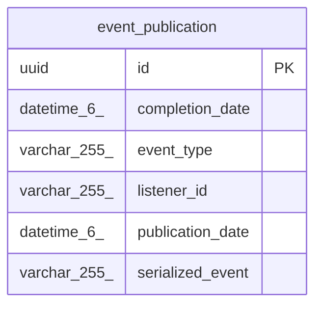

# event_publication

## Description

<details>
<summary><strong>Table Definition</strong></summary>

```sql
CREATE TABLE `event_publication` (
  `id` uuid NOT NULL,
  `completion_date` datetime(6) DEFAULT NULL,
  `event_type` varchar(255) DEFAULT NULL,
  `listener_id` varchar(255) DEFAULT NULL,
  `publication_date` datetime(6) DEFAULT NULL,
  `serialized_event` varchar(255) DEFAULT NULL,
  PRIMARY KEY (`id`)
) ENGINE=InnoDB DEFAULT CHARSET=utf8mb4 COLLATE=utf8mb4_unicode_ci
```

</details>

## Columns

| Name | Type | Default | Nullable | Children | Parents | Comment |
| ---- | ---- | ------- | -------- | -------- | ------- | ------- |
| id | uuid |  | false |  |  |  |
| completion_date | datetime(6) | NULL | true |  |  |  |
| event_type | varchar(255) | NULL | true |  |  |  |
| listener_id | varchar(255) | NULL | true |  |  |  |
| publication_date | datetime(6) | NULL | true |  |  |  |
| serialized_event | varchar(255) | NULL | true |  |  |  |

## Constraints

| Name | Type | Definition |
| ---- | ---- | ---------- |
| PRIMARY | PRIMARY KEY | PRIMARY KEY (id) |

## Indexes

| Name | Definition |
| ---- | ---------- |
| PRIMARY | PRIMARY KEY (id) USING BTREE |

## Relations



---

> Generated by [tbls](https://github.com/k1LoW/tbls)
