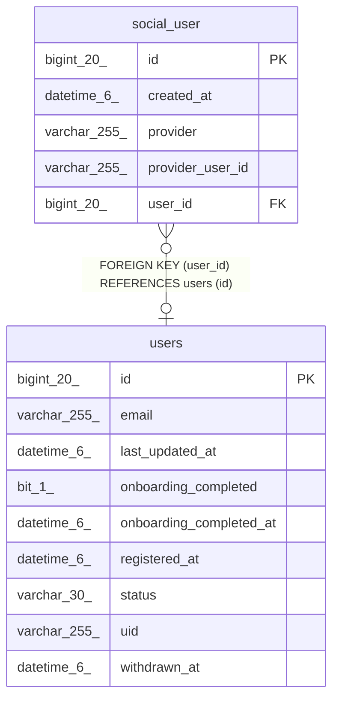

# social_user

## Description

<details>
<summary><strong>Table Definition</strong></summary>

```sql
CREATE TABLE `social_user` (
  `id` bigint(20) NOT NULL AUTO_INCREMENT,
  `created_at` datetime(6) DEFAULT NULL,
  `provider` varchar(255) DEFAULT NULL,
  `provider_user_id` varchar(255) DEFAULT NULL,
  `user_id` bigint(20) DEFAULT NULL,
  PRIMARY KEY (`id`),
  KEY `FKcuirus7h2n9g0fp6rxtrkuiix` (`user_id`),
  CONSTRAINT `FKcuirus7h2n9g0fp6rxtrkuiix` FOREIGN KEY (`user_id`) REFERENCES `users` (`id`)
) ENGINE=InnoDB DEFAULT CHARSET=utf8mb4 COLLATE=utf8mb4_unicode_ci
```

</details>

## Columns

| Name | Type | Default | Nullable | Extra Definition | Children | Parents | Comment |
| ---- | ---- | ------- | -------- | ---------------- | -------- | ------- | ------- |
| id | bigint(20) |  | false | auto_increment |  |  |  |
| created_at | datetime(6) | NULL | true |  |  |  |  |
| provider | varchar(255) | NULL | true |  |  |  |  |
| provider_user_id | varchar(255) | NULL | true |  |  |  |  |
| user_id | bigint(20) | NULL | true |  |  | [users](users.md) |  |

## Constraints

| Name | Type | Definition |
| ---- | ---- | ---------- |
| FKcuirus7h2n9g0fp6rxtrkuiix | FOREIGN KEY | FOREIGN KEY (user_id) REFERENCES users (id) |
| PRIMARY | PRIMARY KEY | PRIMARY KEY (id) |

## Indexes

| Name | Definition |
| ---- | ---------- |
| FKcuirus7h2n9g0fp6rxtrkuiix | KEY FKcuirus7h2n9g0fp6rxtrkuiix (user_id) USING BTREE |
| PRIMARY | PRIMARY KEY (id) USING BTREE |

## Relations



---

> Generated by [tbls](https://github.com/k1LoW/tbls)
