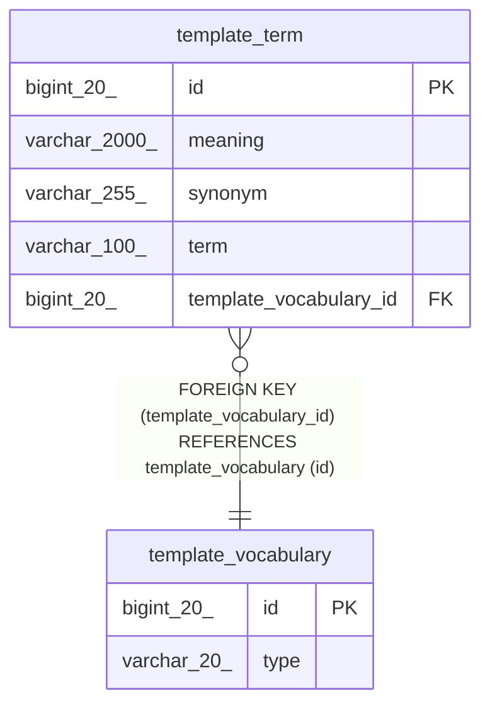

# template_term

## Description

<details>
<summary><strong>Table Definition</strong></summary>

```sql
CREATE TABLE `template_term` (
  `id` bigint(20) NOT NULL AUTO_INCREMENT,
  `meaning` varchar(2000) NOT NULL,
  `synonym` varchar(255) DEFAULT NULL,
  `term` varchar(100) NOT NULL,
  `template_vocabulary_id` bigint(20) NOT NULL,
  PRIMARY KEY (`id`),
  KEY `FKkywu6lcoquw0sprusuftdubp9` (`template_vocabulary_id`),
  CONSTRAINT `FKkywu6lcoquw0sprusuftdubp9` FOREIGN KEY (`template_vocabulary_id`) REFERENCES `template_vocabulary` (`id`)
) ENGINE=InnoDB AUTO_INCREMENT=[Redacted by tbls] DEFAULT CHARSET=utf8mb4 COLLATE=utf8mb4_unicode_ci
```

</details>

## Columns

| Name | Type | Default | Nullable | Extra Definition | Children | Parents | Comment |
| ---- | ---- | ------- | -------- | ---------------- | -------- | ------- | ------- |
| id | bigint(20) |  | false | auto_increment |  |  |  |
| meaning | varchar(2000) |  | false |  |  |  |  |
| synonym | varchar(255) | NULL | true |  |  |  |  |
| term | varchar(100) |  | false |  |  |  |  |
| template_vocabulary_id | bigint(20) |  | false |  |  | [template_vocabulary](template_vocabulary.md) |  |

## Constraints

| Name | Type | Definition |
| ---- | ---- | ---------- |
| FKkywu6lcoquw0sprusuftdubp9 | FOREIGN KEY | FOREIGN KEY (template_vocabulary_id) REFERENCES template_vocabulary (id) |
| PRIMARY | PRIMARY KEY | PRIMARY KEY (id) |

## Indexes

| Name | Definition |
| ---- | ---------- |
| FKkywu6lcoquw0sprusuftdubp9 | KEY FKkywu6lcoquw0sprusuftdubp9 (template_vocabulary_id) USING BTREE |
| PRIMARY | PRIMARY KEY (id) USING BTREE |

## Relations



---

> Generated by [tbls](https://github.com/k1LoW/tbls)
