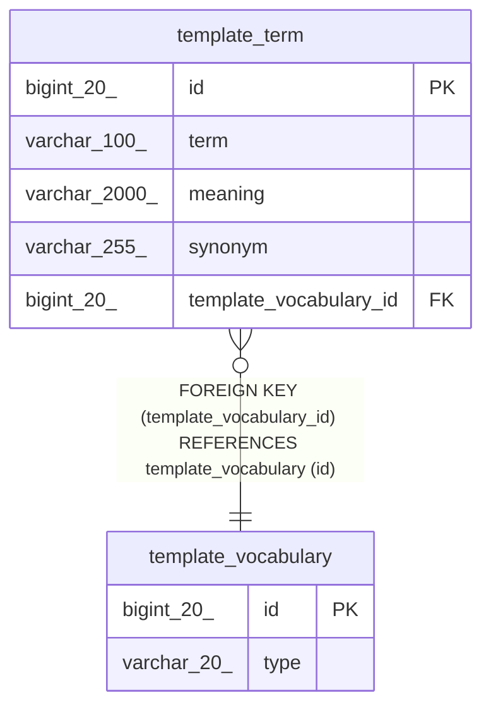

# template_vocabulary

## Description

템플릿 용어집

<details>
<summary><strong>Table Definition</strong></summary>

```sql
CREATE TABLE `template_vocabulary` (
  `id` bigint(20) NOT NULL AUTO_INCREMENT COMMENT 'ID',
  `type` varchar(20) NOT NULL COMMENT '템플릿 용어집 타입',
  PRIMARY KEY (`id`),
  UNIQUE KEY `uk_template_vocabulary_type` (`type`)
) ENGINE=InnoDB AUTO_INCREMENT=[Redacted by tbls] DEFAULT CHARSET=utf8mb4 COLLATE=utf8mb4_unicode_ci COMMENT='템플릿 용어집'
```

</details>

## Columns

| Name | Type | Default | Nullable | Extra Definition | Children | Parents | Comment |
| ---- | ---- | ------- | -------- | ---------------- | -------- | ------- | ------- |
| id | bigint(20) |  | false | auto_increment | [template_term](template_term.md) |  | ID |
| type | varchar(20) |  | false |  |  |  | 템플릿 용어집 타입 |

## Constraints

| Name | Type | Definition |
| ---- | ---- | ---------- |
| PRIMARY | PRIMARY KEY | PRIMARY KEY (id) |
| uk_template_vocabulary_type | UNIQUE | UNIQUE KEY uk_template_vocabulary_type (type) |

## Indexes

| Name | Definition |
| ---- | ---------- |
| PRIMARY | PRIMARY KEY (id) USING BTREE |
| uk_template_vocabulary_type | UNIQUE KEY uk_template_vocabulary_type (type) USING BTREE |

## Relations



---

> Generated by [tbls](https://github.com/k1LoW/tbls)
