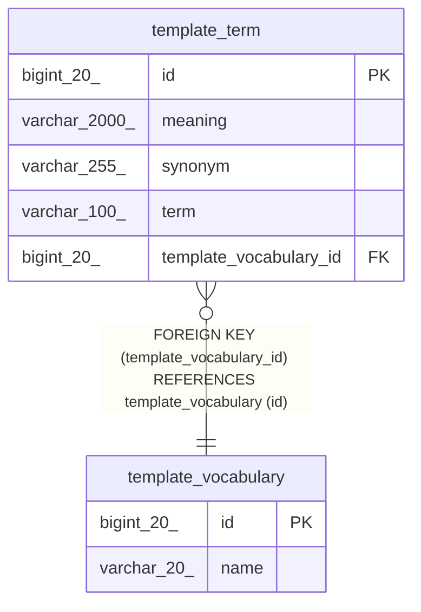

# template_vocabulary

## Description

<details>
<summary><strong>Table Definition</strong></summary>

```sql
CREATE TABLE `template_vocabulary` (
  `id` bigint(20) NOT NULL AUTO_INCREMENT,
  `name` varchar(20) NOT NULL,
  PRIMARY KEY (`id`),
  UNIQUE KEY `UK_7smfim1klyuu5rh21994clsl4` (`name`)
) ENGINE=InnoDB AUTO_INCREMENT=[Redacted by tbls] DEFAULT CHARSET=utf8mb4 COLLATE=utf8mb4_unicode_ci
```

</details>

## Columns

| Name | Type | Default | Nullable | Extra Definition | Children | Parents | Comment |
| ---- | ---- | ------- | -------- | ---------------- | -------- | ------- | ------- |
| id | bigint(20) |  | false | auto_increment | [template_term](template_term.md) |  |  |
| name | varchar(20) |  | false |  |  |  |  |

## Constraints

| Name | Type | Definition |
| ---- | ---- | ---------- |
| PRIMARY | PRIMARY KEY | PRIMARY KEY (id) |
| UK_7smfim1klyuu5rh21994clsl4 | UNIQUE | UNIQUE KEY UK_7smfim1klyuu5rh21994clsl4 (name) |

## Indexes

| Name | Definition |
| ---- | ---------- |
| PRIMARY | PRIMARY KEY (id) USING BTREE |
| UK_7smfim1klyuu5rh21994clsl4 | UNIQUE KEY UK_7smfim1klyuu5rh21994clsl4 (name) USING BTREE |

## Relations



---

> Generated by [tbls](https://github.com/k1LoW/tbls)
