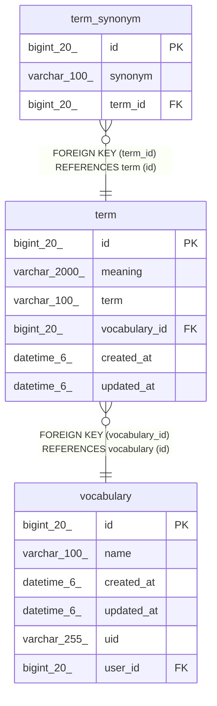

# term

## Description

<details>
<summary><strong>Table Definition</strong></summary>

```sql
CREATE TABLE `term` (
  `id` bigint(20) NOT NULL AUTO_INCREMENT,
  `meaning` varchar(2000) NOT NULL,
  `term` varchar(100) NOT NULL,
  `vocabulary_id` bigint(20) NOT NULL,
  `created_at` datetime(6) DEFAULT NULL,
  `updated_at` datetime(6) DEFAULT NULL,
  PRIMARY KEY (`id`),
  KEY `FKk0u34gq7hfjfe9fnaqk90729c` (`vocabulary_id`),
  CONSTRAINT `FKk0u34gq7hfjfe9fnaqk90729c` FOREIGN KEY (`vocabulary_id`) REFERENCES `vocabulary` (`id`)
) ENGINE=InnoDB DEFAULT CHARSET=utf8mb4 COLLATE=utf8mb4_unicode_ci
```

</details>

## Columns

| Name | Type | Default | Nullable | Extra Definition | Children | Parents | Comment |
| ---- | ---- | ------- | -------- | ---------------- | -------- | ------- | ------- |
| id | bigint(20) |  | false | auto_increment | [term_synonym](term_synonym.md) |  |  |
| meaning | varchar(2000) |  | false |  |  |  |  |
| term | varchar(100) |  | false |  |  |  |  |
| vocabulary_id | bigint(20) |  | false |  |  | [vocabulary](vocabulary.md) |  |
| created_at | datetime(6) | NULL | true |  |  |  |  |
| updated_at | datetime(6) | NULL | true |  |  |  |  |

## Constraints

| Name | Type | Definition |
| ---- | ---- | ---------- |
| FKk0u34gq7hfjfe9fnaqk90729c | FOREIGN KEY | FOREIGN KEY (vocabulary_id) REFERENCES vocabulary (id) |
| PRIMARY | PRIMARY KEY | PRIMARY KEY (id) |

## Indexes

| Name | Definition |
| ---- | ---------- |
| FKk0u34gq7hfjfe9fnaqk90729c | KEY FKk0u34gq7hfjfe9fnaqk90729c (vocabulary_id) USING BTREE |
| PRIMARY | PRIMARY KEY (id) USING BTREE |

## Relations



---

> Generated by [tbls](https://github.com/k1LoW/tbls)
