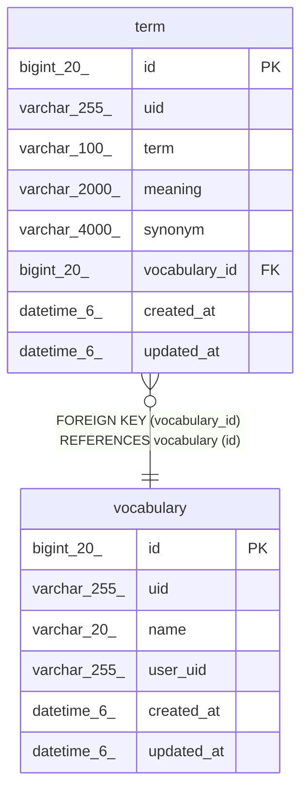

# term

## Description

용어

<details>
<summary><strong>Table Definition</strong></summary>

```sql
CREATE TABLE `term` (
  `id` bigint(20) NOT NULL AUTO_INCREMENT COMMENT 'ID',
  `uid` varchar(255) DEFAULT NULL COMMENT 'UID',
  `term` varchar(100) NOT NULL COMMENT '용어',
  `meaning` varchar(2000) NOT NULL COMMENT '뜻',
  `synonym` varchar(4000) DEFAULT NULL COMMENT '동의어',
  `vocabulary_id` bigint(20) NOT NULL COMMENT '용어집 ID',
  `created_at` datetime(6) DEFAULT NULL COMMENT '생성일시',
  `updated_at` datetime(6) DEFAULT NULL COMMENT '수정일시',
  PRIMARY KEY (`id`),
  UNIQUE KEY `uk_term_uid` (`uid`),
  KEY `fk_term_vocabulary` (`vocabulary_id`),
  CONSTRAINT `fk_term_vocabulary` FOREIGN KEY (`vocabulary_id`) REFERENCES `vocabulary` (`id`)
) ENGINE=InnoDB DEFAULT CHARSET=utf8mb4 COLLATE=utf8mb4_unicode_ci COMMENT='용어'
```

</details>

## Columns

| Name | Type | Default | Nullable | Extra Definition | Children | Parents | Comment |
| ---- | ---- | ------- | -------- | ---------------- | -------- | ------- | ------- |
| id | bigint(20) |  | false | auto_increment |  |  | ID |
| uid | varchar(255) | NULL | true |  |  |  | UID |
| term | varchar(100) |  | false |  |  |  | 용어 |
| meaning | varchar(2000) |  | false |  |  |  | 뜻 |
| synonym | varchar(4000) | NULL | true |  |  |  | 동의어 |
| vocabulary_id | bigint(20) |  | false |  |  | [vocabulary](vocabulary.md) | 용어집 ID |
| created_at | datetime(6) | NULL | true |  |  |  | 생성일시 |
| updated_at | datetime(6) | NULL | true |  |  |  | 수정일시 |

## Constraints

| Name | Type | Definition |
| ---- | ---- | ---------- |
| fk_term_vocabulary | FOREIGN KEY | FOREIGN KEY (vocabulary_id) REFERENCES vocabulary (id) |
| PRIMARY | PRIMARY KEY | PRIMARY KEY (id) |
| uk_term_uid | UNIQUE | UNIQUE KEY uk_term_uid (uid) |

## Indexes

| Name | Definition |
| ---- | ---------- |
| fk_term_vocabulary | KEY fk_term_vocabulary (vocabulary_id) USING BTREE |
| PRIMARY | PRIMARY KEY (id) USING BTREE |
| uk_term_uid | UNIQUE KEY uk_term_uid (uid) USING BTREE |

## Relations



---

> Generated by [tbls](https://github.com/k1LoW/tbls)
