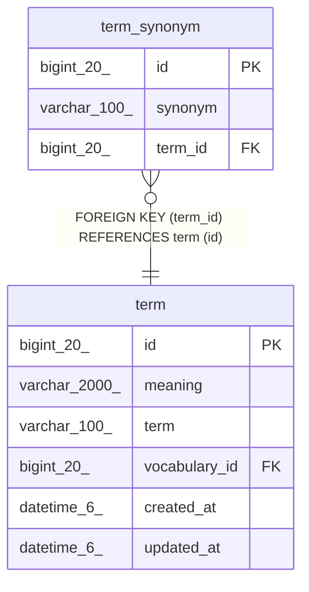

# term_synonym

## Description

<details>
<summary><strong>Table Definition</strong></summary>

```sql
CREATE TABLE `term_synonym` (
  `id` bigint(20) NOT NULL AUTO_INCREMENT,
  `synonym` varchar(100) NOT NULL,
  `term_id` bigint(20) NOT NULL,
  PRIMARY KEY (`id`),
  KEY `FKs40pkmn91x9xglfvf2cmnh2as` (`term_id`),
  CONSTRAINT `FKs40pkmn91x9xglfvf2cmnh2as` FOREIGN KEY (`term_id`) REFERENCES `term` (`id`)
) ENGINE=InnoDB DEFAULT CHARSET=utf8mb4 COLLATE=utf8mb4_unicode_ci
```

</details>

## Columns

| Name | Type | Default | Nullable | Extra Definition | Children | Parents | Comment |
| ---- | ---- | ------- | -------- | ---------------- | -------- | ------- | ------- |
| id | bigint(20) |  | false | auto_increment |  |  |  |
| synonym | varchar(100) |  | false |  |  |  |  |
| term_id | bigint(20) |  | false |  |  | [term](term.md) |  |

## Constraints

| Name | Type | Definition |
| ---- | ---- | ---------- |
| FKs40pkmn91x9xglfvf2cmnh2as | FOREIGN KEY | FOREIGN KEY (term_id) REFERENCES term (id) |
| PRIMARY | PRIMARY KEY | PRIMARY KEY (id) |

## Indexes

| Name | Definition |
| ---- | ---------- |
| FKs40pkmn91x9xglfvf2cmnh2as | KEY FKs40pkmn91x9xglfvf2cmnh2as (term_id) USING BTREE |
| PRIMARY | PRIMARY KEY (id) USING BTREE |

## Relations



---

> Generated by [tbls](https://github.com/k1LoW/tbls)
