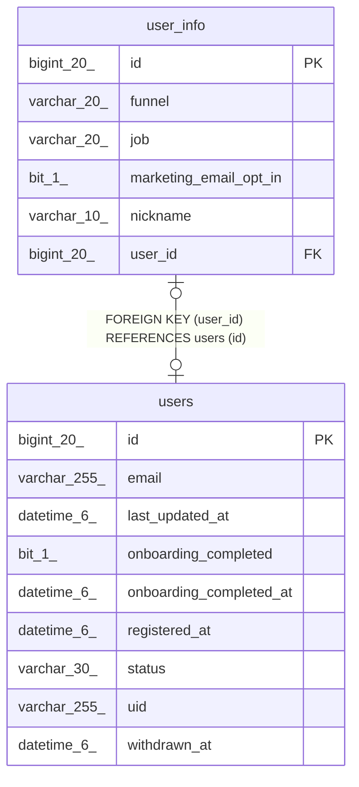

# user_info

## Description

<details>
<summary><strong>Table Definition</strong></summary>

```sql
CREATE TABLE `user_info` (
  `id` bigint(20) NOT NULL AUTO_INCREMENT,
  `funnel` varchar(20) DEFAULT NULL,
  `job` varchar(20) DEFAULT NULL,
  `marketing_email_opt_in` bit(1) DEFAULT NULL,
  `nickname` varchar(10) NOT NULL,
  `user_id` bigint(20) DEFAULT NULL,
  PRIMARY KEY (`id`),
  UNIQUE KEY `UKhixwjgx0ynne0cq4tqvoawoda` (`user_id`),
  CONSTRAINT `FKr1b96ca4asuvrhwoqkdmbo7nj` FOREIGN KEY (`user_id`) REFERENCES `users` (`id`)
) ENGINE=InnoDB DEFAULT CHARSET=utf8mb4 COLLATE=utf8mb4_unicode_ci
```

</details>

## Columns

| Name | Type | Default | Nullable | Extra Definition | Children | Parents | Comment |
| ---- | ---- | ------- | -------- | ---------------- | -------- | ------- | ------- |
| id | bigint(20) |  | false | auto_increment |  |  |  |
| funnel | varchar(20) | NULL | true |  |  |  |  |
| job | varchar(20) | NULL | true |  |  |  |  |
| marketing_email_opt_in | bit(1) | NULL | true |  |  |  |  |
| nickname | varchar(10) |  | false |  |  |  |  |
| user_id | bigint(20) | NULL | true |  |  | [users](users.md) |  |

## Constraints

| Name | Type | Definition |
| ---- | ---- | ---------- |
| FKr1b96ca4asuvrhwoqkdmbo7nj | FOREIGN KEY | FOREIGN KEY (user_id) REFERENCES users (id) |
| PRIMARY | PRIMARY KEY | PRIMARY KEY (id) |
| UKhixwjgx0ynne0cq4tqvoawoda | UNIQUE | UNIQUE KEY UKhixwjgx0ynne0cq4tqvoawoda (user_id) |

## Indexes

| Name | Definition |
| ---- | ---------- |
| PRIMARY | PRIMARY KEY (id) USING BTREE |
| UKhixwjgx0ynne0cq4tqvoawoda | UNIQUE KEY UKhixwjgx0ynne0cq4tqvoawoda (user_id) USING BTREE |

## Relations



---

> Generated by [tbls](https://github.com/k1LoW/tbls)
