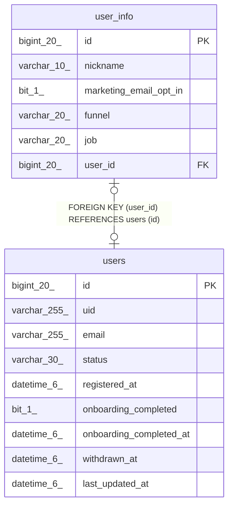

# user_info

## Description

사용자 정보

<details>
<summary><strong>Table Definition</strong></summary>

```sql
CREATE TABLE `user_info` (
  `id` bigint(20) NOT NULL AUTO_INCREMENT COMMENT 'ID',
  `nickname` varchar(10) NOT NULL COMMENT '닉네임',
  `marketing_email_opt_in` bit(1) DEFAULT NULL COMMENT '마케팅 이메일 수신 여부',
  `funnel` varchar(20) DEFAULT NULL COMMENT '유입 경로',
  `job` varchar(20) DEFAULT NULL COMMENT '직업',
  `user_id` bigint(20) DEFAULT NULL COMMENT '사용자 ID',
  PRIMARY KEY (`id`),
  UNIQUE KEY `uk_user_info_user_id` (`user_id`),
  CONSTRAINT `fk_user_info_users` FOREIGN KEY (`user_id`) REFERENCES `users` (`id`)
) ENGINE=InnoDB DEFAULT CHARSET=utf8mb4 COLLATE=utf8mb4_unicode_ci COMMENT='사용자 정보'
```

</details>

## Columns

| Name | Type | Default | Nullable | Extra Definition | Children | Parents | Comment |
| ---- | ---- | ------- | -------- | ---------------- | -------- | ------- | ------- |
| id | bigint(20) |  | false | auto_increment |  |  | ID |
| nickname | varchar(10) |  | false |  |  |  | 닉네임 |
| marketing_email_opt_in | bit(1) | NULL | true |  |  |  | 마케팅 이메일 수신 여부 |
| funnel | varchar(20) | NULL | true |  |  |  | 유입 경로 |
| job | varchar(20) | NULL | true |  |  |  | 직업 |
| user_id | bigint(20) | NULL | true |  |  | [users](users.md) | 사용자 ID |

## Constraints

| Name | Type | Definition |
| ---- | ---- | ---------- |
| fk_user_info_users | FOREIGN KEY | FOREIGN KEY (user_id) REFERENCES users (id) |
| PRIMARY | PRIMARY KEY | PRIMARY KEY (id) |
| uk_user_info_user_id | UNIQUE | UNIQUE KEY uk_user_info_user_id (user_id) |

## Indexes

| Name | Definition |
| ---- | ---------- |
| PRIMARY | PRIMARY KEY (id) USING BTREE |
| uk_user_info_user_id | UNIQUE KEY uk_user_info_user_id (user_id) USING BTREE |

## Relations



---

> Generated by [tbls](https://github.com/k1LoW/tbls)
