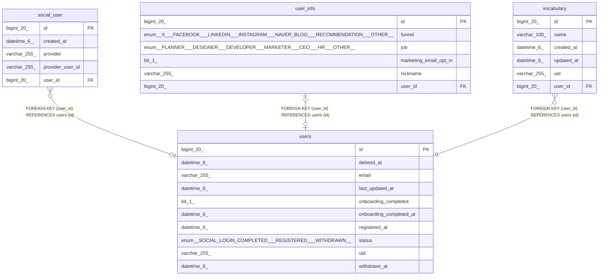

# users

## Description

<details>
<summary><strong>Table Definition</strong></summary>

```sql
CREATE TABLE `users` (
  `id` bigint(20) NOT NULL AUTO_INCREMENT,
  `deleted_at` datetime(6) DEFAULT NULL,
  `email` varchar(255) DEFAULT NULL,
  `last_updated_at` datetime(6) DEFAULT NULL,
  `onboarding_completed` bit(1) NOT NULL,
  `onboarding_completed_at` datetime(6) DEFAULT NULL,
  `registered_at` datetime(6) DEFAULT NULL,
  `status` enum('SOCIAL_LOGIN_COMPLETED','REGISTERED','WITHDRAWN') DEFAULT NULL,
  `uid` varchar(255) DEFAULT NULL,
  `withdrawn_at` datetime(6) DEFAULT NULL,
  PRIMARY KEY (`id`),
  UNIQUE KEY `UK_6dotkott2kjsp8vw4d0m25fb7` (`email`)
) ENGINE=InnoDB AUTO_INCREMENT=[Redacted by tbls] DEFAULT CHARSET=utf8mb4 COLLATE=utf8mb4_unicode_ci
```

</details>

## Columns

| Name | Type | Default | Nullable | Extra Definition | Children | Parents | Comment |
| ---- | ---- | ------- | -------- | ---------------- | -------- | ------- | ------- |
| id | bigint(20) |  | false | auto_increment | [social_user](social_user.md) [user_info](user_info.md) [vocabulary](vocabulary.md) |  |  |
| deleted_at | datetime(6) | NULL | true |  |  |  |  |
| email | varchar(255) | NULL | true |  |  |  |  |
| last_updated_at | datetime(6) | NULL | true |  |  |  |  |
| onboarding_completed | bit(1) |  | false |  |  |  |  |
| onboarding_completed_at | datetime(6) | NULL | true |  |  |  |  |
| registered_at | datetime(6) | NULL | true |  |  |  |  |
| status | enum('SOCIAL_LOGIN_COMPLETED','REGISTERED','WITHDRAWN') | NULL | true |  |  |  |  |
| uid | varchar(255) | NULL | true |  |  |  |  |
| withdrawn_at | datetime(6) | NULL | true |  |  |  |  |

## Constraints

| Name | Type | Definition |
| ---- | ---- | ---------- |
| PRIMARY | PRIMARY KEY | PRIMARY KEY (id) |
| UK_6dotkott2kjsp8vw4d0m25fb7 | UNIQUE | UNIQUE KEY UK_6dotkott2kjsp8vw4d0m25fb7 (email) |

## Indexes

| Name | Definition |
| ---- | ---------- |
| PRIMARY | PRIMARY KEY (id) USING BTREE |
| UK_6dotkott2kjsp8vw4d0m25fb7 | UNIQUE KEY UK_6dotkott2kjsp8vw4d0m25fb7 (email) USING BTREE |

## Relations



---

> Generated by [tbls](https://github.com/k1LoW/tbls)
