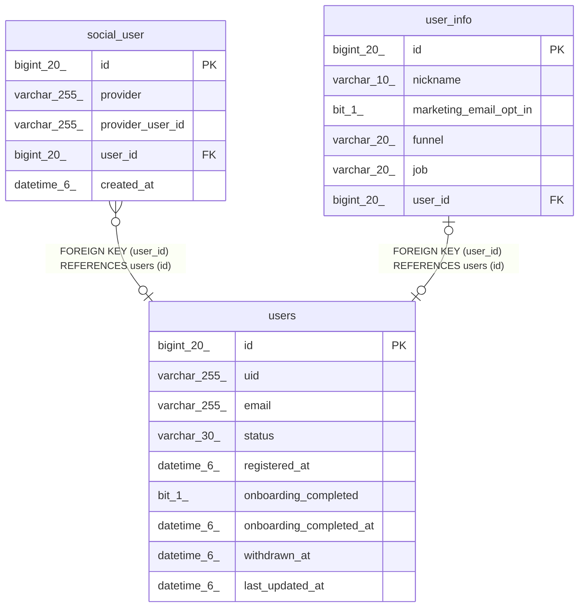

# users

## Description

사용자

<details>
<summary><strong>Table Definition</strong></summary>

```sql
CREATE TABLE `users` (
  `id` bigint(20) NOT NULL AUTO_INCREMENT COMMENT 'ID',
  `uid` varchar(255) DEFAULT NULL COMMENT 'UID',
  `email` varchar(255) DEFAULT NULL COMMENT '이메일',
  `status` varchar(30) NOT NULL COMMENT '상태',
  `registered_at` datetime(6) DEFAULT NULL COMMENT '가입 일시',
  `onboarding_completed` bit(1) NOT NULL COMMENT '온보딩 완료 여부',
  `onboarding_completed_at` datetime(6) DEFAULT NULL COMMENT '온보딩 완료 일시',
  `withdrawn_at` datetime(6) DEFAULT NULL COMMENT '탈퇴 일시',
  `last_updated_at` datetime(6) DEFAULT NULL COMMENT '마지막 수정 일시',
  PRIMARY KEY (`id`),
  UNIQUE KEY `uk_users_email` (`email`),
  UNIQUE KEY `uk_users_uid` (`uid`)
) ENGINE=InnoDB DEFAULT CHARSET=utf8mb4 COLLATE=utf8mb4_unicode_ci COMMENT='사용자'
```

</details>

## Columns

| Name | Type | Default | Nullable | Extra Definition | Children | Parents | Comment |
| ---- | ---- | ------- | -------- | ---------------- | -------- | ------- | ------- |
| id | bigint(20) |  | false | auto_increment | [social_user](social_user.md) [user_info](user_info.md) |  | ID |
| uid | varchar(255) | NULL | true |  |  |  | UID |
| email | varchar(255) | NULL | true |  |  |  | 이메일 |
| status | varchar(30) |  | false |  |  |  | 상태 |
| registered_at | datetime(6) | NULL | true |  |  |  | 가입 일시 |
| onboarding_completed | bit(1) |  | false |  |  |  | 온보딩 완료 여부 |
| onboarding_completed_at | datetime(6) | NULL | true |  |  |  | 온보딩 완료 일시 |
| withdrawn_at | datetime(6) | NULL | true |  |  |  | 탈퇴 일시 |
| last_updated_at | datetime(6) | NULL | true |  |  |  | 마지막 수정 일시 |

## Constraints

| Name | Type | Definition |
| ---- | ---- | ---------- |
| PRIMARY | PRIMARY KEY | PRIMARY KEY (id) |
| uk_users_email | UNIQUE | UNIQUE KEY uk_users_email (email) |
| uk_users_uid | UNIQUE | UNIQUE KEY uk_users_uid (uid) |

## Indexes

| Name | Definition |
| ---- | ---------- |
| PRIMARY | PRIMARY KEY (id) USING BTREE |
| uk_users_email | UNIQUE KEY uk_users_email (email) USING BTREE |
| uk_users_uid | UNIQUE KEY uk_users_uid (uid) USING BTREE |

## Relations



---

> Generated by [tbls](https://github.com/k1LoW/tbls)
