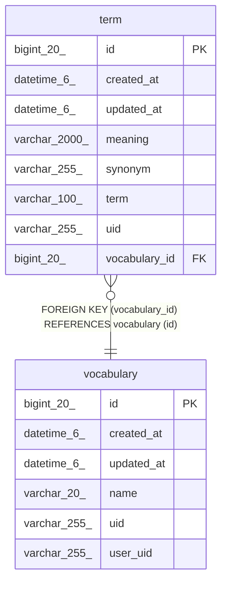

# vocabulary

## Description

<details>
<summary><strong>Table Definition</strong></summary>

```sql
CREATE TABLE `vocabulary` (
  `id` bigint(20) NOT NULL AUTO_INCREMENT,
  `created_at` datetime(6) DEFAULT NULL,
  `updated_at` datetime(6) DEFAULT NULL,
  `name` varchar(20) NOT NULL,
  `uid` varchar(255) DEFAULT NULL,
  `user_uid` varchar(255) NOT NULL,
  PRIMARY KEY (`id`)
) ENGINE=InnoDB DEFAULT CHARSET=utf8mb4 COLLATE=utf8mb4_unicode_ci
```

</details>

## Columns

| Name | Type | Default | Nullable | Extra Definition | Children | Parents | Comment |
| ---- | ---- | ------- | -------- | ---------------- | -------- | ------- | ------- |
| id | bigint(20) |  | false | auto_increment | [term](term.md) |  |  |
| created_at | datetime(6) | NULL | true |  |  |  |  |
| updated_at | datetime(6) | NULL | true |  |  |  |  |
| name | varchar(20) |  | false |  |  |  |  |
| uid | varchar(255) | NULL | true |  |  |  |  |
| user_uid | varchar(255) |  | false |  |  |  |  |

## Constraints

| Name | Type | Definition |
| ---- | ---- | ---------- |
| PRIMARY | PRIMARY KEY | PRIMARY KEY (id) |

## Indexes

| Name | Definition |
| ---- | ---------- |
| PRIMARY | PRIMARY KEY (id) USING BTREE |

## Relations



---

> Generated by [tbls](https://github.com/k1LoW/tbls)
