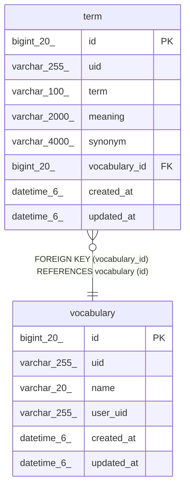

# vocabulary

## Description

용어집

<details>
<summary><strong>Table Definition</strong></summary>

```sql
CREATE TABLE `vocabulary` (
  `id` bigint(20) NOT NULL AUTO_INCREMENT COMMENT 'ID',
  `uid` varchar(255) DEFAULT NULL COMMENT 'UID',
  `name` varchar(20) NOT NULL COMMENT '이름',
  `user_uid` varchar(255) NOT NULL COMMENT '사용자 UID',
  `created_at` datetime(6) DEFAULT NULL COMMENT '생성일시',
  `updated_at` datetime(6) DEFAULT NULL COMMENT '수정일시',
  PRIMARY KEY (`id`),
  UNIQUE KEY `uk_vocabulary_uid` (`uid`),
  KEY `idx_vocabulary_user_uid` (`user_uid`)
) ENGINE=InnoDB DEFAULT CHARSET=utf8mb4 COLLATE=utf8mb4_unicode_ci COMMENT='용어집'
```

</details>

## Columns

| Name | Type | Default | Nullable | Extra Definition | Children | Parents | Comment |
| ---- | ---- | ------- | -------- | ---------------- | -------- | ------- | ------- |
| id | bigint(20) |  | false | auto_increment | [term](term.md) |  | ID |
| uid | varchar(255) | NULL | true |  |  |  | UID |
| name | varchar(20) |  | false |  |  |  | 이름 |
| user_uid | varchar(255) |  | false |  |  |  | 사용자 UID |
| created_at | datetime(6) | NULL | true |  |  |  | 생성일시 |
| updated_at | datetime(6) | NULL | true |  |  |  | 수정일시 |

## Constraints

| Name | Type | Definition |
| ---- | ---- | ---------- |
| PRIMARY | PRIMARY KEY | PRIMARY KEY (id) |
| uk_vocabulary_uid | UNIQUE | UNIQUE KEY uk_vocabulary_uid (uid) |

## Indexes

| Name | Definition |
| ---- | ---------- |
| idx_vocabulary_user_uid | KEY idx_vocabulary_user_uid (user_uid) USING BTREE |
| PRIMARY | PRIMARY KEY (id) USING BTREE |
| uk_vocabulary_uid | UNIQUE KEY uk_vocabulary_uid (uid) USING BTREE |

## Relations



---

> Generated by [tbls](https://github.com/k1LoW/tbls)
